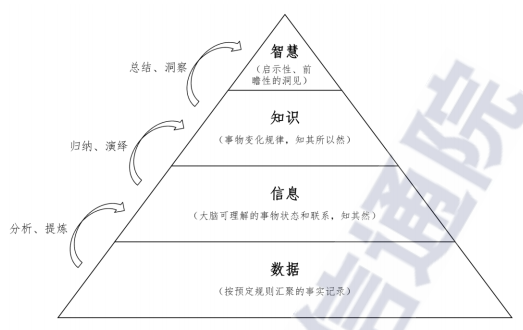
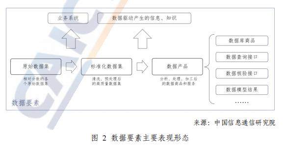
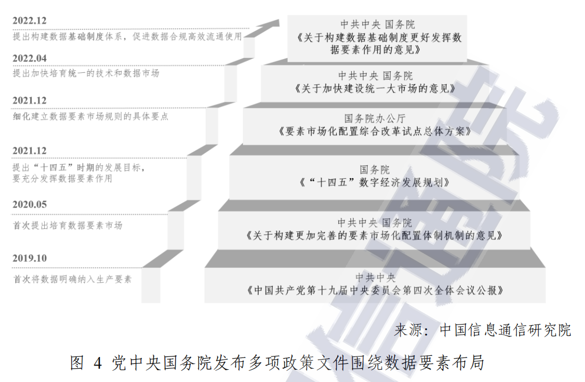
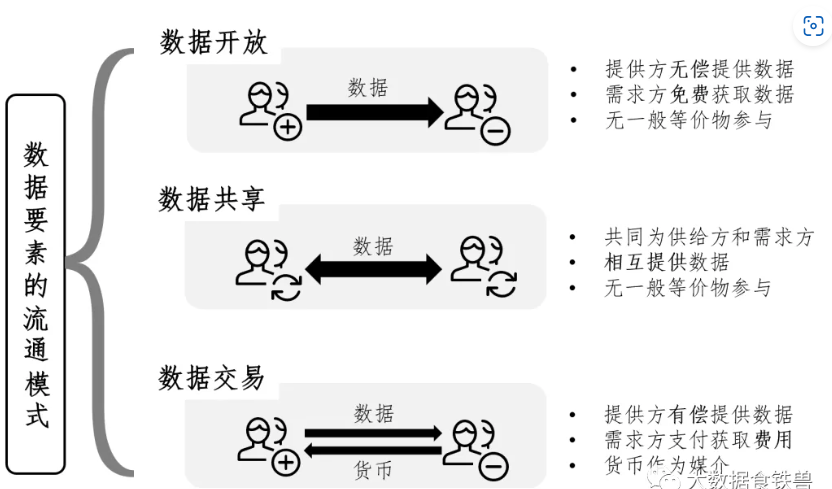

# 数据要素学习报告

​																																								整理by 张福良

[TOC]

## 01| 什么是数据要素

### 数据的概念与独特属性

数据-信息-知识-智慧模型(DIKW)

​		数据与**土地、劳动、资本、技术**等传统生产要素相比有明显的独特性。

​		数据首先作为独特的**技术产物**，具有**虚拟性、低成本复制性**和**主体多元性**(用户、收集者、加工者等)。这些技术特性影响着数据在经济活动中的性质(**经济对象**)，使数据具备了**非竞争性(一组数据可以被多个主体使用)、潜在的非排他性(当放弃控制数据的手段或控制的手段被攻破，就具有完全的非排他性)**和**异质性(相同数据对不同使用者和不同应用场景的价值不同，与之鲜明对比的是资本)**。数据的以上特性使得与传统要素相匹配的规则体系、生态系统等难以直接沿用。

> **排他性**是定界产品权力的重要基础，土地、劳动、资本都有**竞争性**和**排他性**，可以在市场上充分实现权利流转，技术在当今专利保护制度下具有排他性，也可以实现权利转让和许可。
>
> （来自《数据要素白皮书（2022年）》）

### 数据成为生产要素有深厚的技术和产业背景。

> 生产要素是生产过程中为获得经济利益所投入资源的高度凝练。每当经济增长速度快于已知要素投入增长速度时，就可以概括出新的要素来说明其余要素未能说明的剩余产出。因此，生产要素时随着生产力的发展不断扩充的。（来自《数据要素白皮书（2022年）》）

将数据列为生产要素的原因在于它对推动生产力发展已显现出突出价值。

1. 20世纪70年代，**关系数据库**的发展使数据处理效率大幅提升，数据推动生产的机制初步显现。
2. 20世纪末，挖掘数据价值的需求不断增长，**数据仓库**与**数据分析**技术迅速增长，数据在生产中的意义进一步显现。
3. 进入21世纪，数据的**大规模集中和高维度分析**全面推动生产效率。(Hadoop、Storm、Spark、Flink、流式计算、数据湖、数据中台等秒级收集系统的建设)

​		 数据技术的发展伴随着数据应用需求的演变，影响着数据投入生产的方式和规模，数据在相应技术和产业背景的演变中逐渐成为促进生产的关键要素。因此，“数据要素”一词是面向数字经济，在讨论生产力和成产关系的语境中对“数据”的指代，是对数据促进价值的强调，即**数据要素指的是根据特定生产需求汇聚、整理、加工而成的计算机数据及其衍生形态。**

### 数据要素主要通过三条途径实现价值

1. 一次价值：数据支撑业务贯通。
   - 数据投入生产的一次价值体现在支撑企业、政府的业务系统运转，实现业务间的贯通
   - 为推动数据的一次价值释放，企业、政府主要工作重心是业务数字化及各类业务信息系统建设。
2. 二次价值：数据推动数智决策。
   - 数据要素投入生产的二次价值释放体现在通过数据的加工、分析、建模，可以揭示出更深层次的关系和规律，使生产、经营、服务、治理等环节的决策更智慧、更智能、更精准。
   - 数据二次价值的释放过程对企业数据挖掘和洞察能力提出更高要求。
3. 三次价值：数据流通对外赋能。
   - 数据要素投入生产的三次价值释放让数据流通到更需要的地方，让不同来源的优质数据在新的业务需求和场景中汇聚聚合，实现双赢、多赢的价值利用。
   - 在数据的三次价值释放过程中，数据要素市场及其技术路径成为行业关注的焦点。

技术路径：

保障数据安全的前提下->保障提供方数据安全、防止数据价值稀释的数据流通技术蓬勃发展，以**隐私计算**为代表的数据流通技术提供了**“数据可用不可见”“数据可控可计量”**的流通新新范式。

> 数据安全有序流通的技术成为了数据要素三次价值释放的关键，也为数据要素市场建设提供了重要的技术路径。（来自《数据要素白皮书（2022年）》）

## 02| 数据要素市场培育现状

​		  数据要素市场是以**数据产品及服务**为流通对象，以**数据供方、需方**为主体，通过**流通实现参与方各自诉求**的场所，是**一系列制度和技术支撑**的复杂系统，是促进数据自主有序流动、提高配置效率、发挥数据价值的关键。

### 数据要素市场的政策布局

数据要素市场政策布局不断深入细化

​		我国自2019年十九届四中全会首次将数据增列为生产要素以来，中央发布多项政策文件，围绕数据要素发展进行谋篇布，并将关注点聚焦于数据要素市场建设。  

>  在国家促进要素市场化配置系列政策指导下，各地方政府及有关单位积极探索数据要素市场化配置改革，推进数据要素价值体系建立、数据要素市场规则构建等工作。（来自《数据要素白皮书（2022年）》）

### 数据要素市场价值化的三种流通形式

​		培育数据要素市场的目标是数据在各市场主体间高效有序自由流通。按照数据与资金在主体间流向的不同，可分为**开放、共享、交易**三种流通形式。

 

1. 数据开放：**以公共数据为主的开放持续推进**
   - 数据开放是指提供方无偿提供数据，需求方免费获取数据，没有货币媒介参与的数据向流通形式。是政府基于公平的原则面向公众及企事业进行公共性数据进行信息共享的主要方式。
2. 数据共享：**政府参与的数据共享趋势加强**
   - 数据共享是指互为供需双方，相互提供数据，没有货币媒介参与的数据双向流通形式。根据共享主体的不同，可分为政府间共享、政企间共享、企业之间共享等形式。
   - 我国政府间数据共享工作持续土建，国家数据共享交换平台进一步完善。
   - 政企间数据共享逐渐形成趋势。
3. 数据交易：**场外需求旺盛，场内重启热潮**
   - 数据交易是指数据提供方提供数据，需求方支付获取费用，主要以货币作为交换媒介的数据单向流通形式。
   - 数据交易机构试图消除供需双方的信息差，推动形成合理的市场化机制和可复制的交易制度和规则。
   - 新一批数据交易机构从强化技术支撑、完善配套规则入手，探索在要素市场中立足点、突破点，帮助市场建立信任、权益保障。一是搭建“数据可用不可见”的数据可信流通技术平台。二是发布数据交易规则和交易凭证（贵州大数据交易所为**数据产品、数据商、第三方数据服务中介机构**等提供登记凭证，探索解决市场主体互信难得问题）。

### 数据要素市场供需对接向多行业发展

目前参与数据要素市场的主体较为集中

1. 数据提供方：

   - 主体：各级政府、电信运营商、大型国有企业、大型互联网公司

   - 提供数据：海量经济社会、行业、用户数据，
   - 提供形式：通过数据接口、数据产品、数据服务等形式可满足大量企业的数据需求。

2. 数据需求方：
   - 主体：金融机构、零售企业等机构。
   - 目的：通过获取外部数据来优化业务。

上海提出打造“数商”新生态。“以数据作为业务活动的主要对象的经济体”

## 03| 数据要素发展面临的挑战与探索思路

> 总体而言，我国数据要素探索处于起步阶段，数据要素市场培育的基础尚不坚实，**权利关系、价格机制、流通规则、技术支撑**等数据要素市场的构成要件存在诸多障碍，需要不断推进相应的理论研究和制度设计，通过试点应用积累实践经验，持续探索各方面难题的解决方案。（来自《数据要素白皮书（2022年）》）

### 权力归属难以界定，有待建立产权制度

1. 问题分析：
   - **数据权属界定的场景与问题复杂，难以达成伦理共识。**传统生产要素的流通和生产关系的建立都是以生产要素的所有权为核心，在所有权基础上围绕使用权、收益权等其他权利进行。数据权属问题复杂的原因在于，传统生产要素往往具有稀缺性、排他性，拥有清晰的、可分割的客体和明确的、独立的占有主体，传统产权制度设计可以通过评估、登记、监管等机制有效解决权利划分、争议仲裁等问题。
   - **制度设计目标与产业实际需求不完全一直，难以凝聚产业共识。**对数据权属制度的设计与建设来说，其目标是明确数据的产权结构归属规则，划定各参与方的权利和责任，通过制度设计保障数据可控。但对产业中实际的数据流通与使用而言，现阶段解决数据权属问题的核心需求，不是决定数据权到底赋予谁，而是如何理顺个人、企业、政府等不同主体间的不同权益，优化利益分配。
   - **我国法律尚未对数据权属做出清晰规定，难以形成规则共识。**现在法律多是从保护和监管的角度出发，通过《网络安全法》《数据安全法》《个人信息保护法》等规范数据的利用，但还没有一部法律对各种场景下的数据归谁所有做出明确界定，现行法律也较少涉及数据本身所承载的其他权益关系。

2. 探索思路：
   - **结合顶层设计与实践经验，逐步形成中国特色的数据产权制度体系。** 探索建立数据产权制度，推进**公共数据、企业数据、个人数据**分类分级确权授权使用，探索数据产权结构性分置制度，建立**数据资源持有权、数据加工使用权、数据产品经营权**等分置的产权运行机制，健全书要素权益保保护制度。应结合实际情况，对“数据分级确权”和“产权分置运行机制"的制度设计进行优化。

### 估值定价缺乏依据，有待发挥市场作用

1. 问题分析：
   - **传统得资产评估方法不完全适用于数据要素。**传统的资产评估方法包括**成本法、收益法、市场法**三种。成本法以成本估值（数据涉及多元主体，成本不易区分，且贬值元素难以估算），收益法以预期收益折现估值（数据的时效性、使用期限评估又成为难点），市场法是以市场上类似交易的成交价格作为估值参考（数据市场不活跃，缺乏足够案例支持）。
   - **数据产品价格很难根据统一的标准衡量。** 卖方定价缺乏博弈、协议定价耗费大量时间和人力，市场定价缺乏统一规则难以衡量。
   - **会计报表核算数据价值价格面临挑战。**

2. 探索思路
   - 深入研究数据价值评估的理论依据。
   - 开展数据估值定价试点
   - 建立健全数据要素价格监管制度，探索科学规范的数据定价检测模型。

### 流通规则尚不完善，有待鼓励积极探索

1. 问题分析：
   - **现有法律法规尚不完善，难以消除市场主体的合规顾虑。**法律是合规的底线，《网络安全法》《数据安全法》《个人信息保护法》等现有法律主要对数据的规范利用和安全隐私保护做出的原则性规定，但并未就数据流通市场的准入、监管等给出清晰的法律界定。
   - **配套规则体系人不明确，数据要素流通缺乏有效的激励和权益保护机制。**现阶段，我国数据资源化、资产化等过程尚未完成，数据作为资产或者商品直接进行流通的理论基础不扎实，数据要素权属界定、分级分类、估值定价、收益分配等方面缺乏系统框架，数据要素流通难以制定明确的配套规则。因此，激励各方参与流通、各方权益保障、参与方之间的信任建立缺乏规则指引，使参与方望而却步。
     - 具体而言，在**数据供给环节**，数据提供方常缺乏提供数据的意愿，除对合规风险的顾虑外，激励机制的缺失也会导致数据供给不足。
     - **在供需对接环节上**，除权责利的界定与分配缺乏共识规约外，市场参与方还存在信任壁垒。供方担心需求方对数据的使用超出约定，需方担心供方的数据不真实、不合规。
     - **在需方应用环节**，现有的数据流通过程和数据流通结果的审计监督机制薄弱。无论使点对点的直接流通还是通过数据交易机构进行的间接流通，通过协议或者合同建立的事前信任约束效用有限，一旦数据集交付或者接口调用结束，数据提供方很难确认需求方是否按照协议约束对数据进行后续处理和应用。
   
2. 探索思路：

   - 一是建立容错免责机制，划定法律监管红线。
   - 二是持续鼓励并推进地方及行业的数据要素市场规则探索。
   - 三是借鉴传统要素市场经验，推动数据要素市场规则建设。
     - 一是依托各类登记管理办法，通过登记实现交易基础和交易行为的认定。
     - 二是有《土地管理法》《证券法》《促进科技成果转化法》等明确的监管规则保障市场秩序。
     - 三是由交易磋商、资信评级、中介代理等配套的服务体系。

   - 四是逐步探索多层次的数据要素市场体系。要坚持场内外相结合的发展思路，结合数据流通的不同形态探索多层次的数据要素市场体系建设，分别建立各层市场的监督管理机制，更好发挥市场主体在各层市场中的作用。

     - 第一层是数据登记市场，实现数据资源归集、权属确认、要能做到一地登记，全国共享
     - 第二层是数据产品市场，实现数据加工使用权的流通；
     - 第三层是数据衍生产品市场，实现各类基于数据加工处理形成的数据商品、应用或者服务的交易。

     

### 流通技术仍未成熟，有待强化技术支撑

1. 问题分析：

   - **数据在多主体间的安全流转过程需要恰当成熟的技术工具支撑。**数据安全和隐私保护是数据流通的前提，流通的数据可能侵犯个人隐私，也可能减损企业的商业秘密和知识产权。由于数据具有低成本复制性，屡发的数据泄漏、越权滥用等事件加剧了人们的不信任感，各主体均有对数据出域后失控的顾虑。**因此，如何保护在数据安全和隐私的同时保证数据的可用性成为数据流通中的迫切需求。**
   - **数据流通涉及诸多技术环节的协同，现阶段数据安全流通技术体系尚未完全成熟。** 如何实现在原始数据可见的形态下保证流通的数据不被复制、篡改，目前尚无可行的技术解。
     - 以**数据脱敏、数据失真**为代表的技术可以较低成本隐藏敏感信息，但这类技术会改变原始数据形态，导致大量数据信息损失，价值大幅降低。
     - **隐私计算技术**和产业逐渐火热，被视为解决数据要素流通难题的关键技术。可实现“原始数据不出域”，保障数据在流通和融合过程中“可用不可见”，只实现数据价值的转移，有效解决数据流通后潜在的时空问题。但它在性能、安全和数据的互联互通等方面仍存在挑战，较高的技术成本也让众多企业望而却步，限制了隐私计算的推广和应用。
   - **性能瓶颈阻碍隐私计算规模化应用**
   - **安全合规挑战影响市场信任。**任何信息技术产品都没有绝对的安全，算法协议安全和开发应用安全是隐私计算产品安全性的两大挑战。联邦学习技术路线和可信执行环境技术路线都有挑战。而法律不会为技术细节背书，使用隐私计算无法完全规避安全合规风险。
   - **互联互通壁垒或使“数据孤岛”变成“数据群岛”。**由于隐私计算底层技术和上层开发设计多样复杂，不同技术产品间无法互认、互用，因而可能将“数据孤岛”催生转化为“数据群岛”。现阶段，各技术厂商都在探索异构隐私计算互联互通的实现，但尚未出现完全成熟的案例。

2. 探索思路：

   - **一是推动多元前沿技术的融合互补。** 任何单一技术都不能一蹴而就地解决制约数据要素市场建设的所有问题，每项技术都只能针对性地解决数据要素市场建设过程中的某个具体问题。因而各项技术需要相互融合才能构成数据要素市场建设的有力支撑。
     - 隐私计算与区块链结合已成为数据要素安全流通的一大探索方向。区块链和隐私计算都融合了密码学理论以增强安全。结合隐私计算，区块链可以获得数据保密能力，增强区块链在链节点上全节点流转过程中的安全性；借助区块链，隐私计算的过程数据和关键计算环节等信息通过上链实现存证回溯，将有力提升隐私计算任务的可验证性。

   - 二是持续攻关核心技术。
     - 硬件加速在隐私计算性能提升方面正发挥越来越关键的作用，软硬件协同优化性能将提升技术可用性。
     - **分布式隐私计算逐渐应用，为解决隐私计算的瓶颈提供了优秀实践。**对于数据要素市场最理想的技术支撑方案，**即同时保障数据可见、可用又可控的创新技术方案**，需要鼓励各界勇于探索和尝试，以新技术、新模式牵引数据流通的新需求。

   - 三是强化技术应用的市场认知。 加快形成技术应用指南和推广示范案例，鼓励开源等。
   - 四是加快完善技术合规监管体系。需要针对数据流通关键技术（隐私计算）应用的具体指导意见和标准规范，为企业的技术实践提供明确依据。随着供给手段和破解技术的不断发展，合规要求将不断更新，技术的发展也应随之动态演变。

## 04| 数据要素发展展望

 1. “十三五”时期的目标

    - 未来应牢牢抓住业务发展的核心问题，深入分析数据应用的具体路径，持续推动数据要素在业务贯通、数智决策方面的释放。

 2. “十四五”时期：

    - 一是充分开展数据要素基本问题研究。

    - 二是推荐数据要素应用与流通的创新探索。

    - 三是鼓励数据要素相关技术研发创新。
